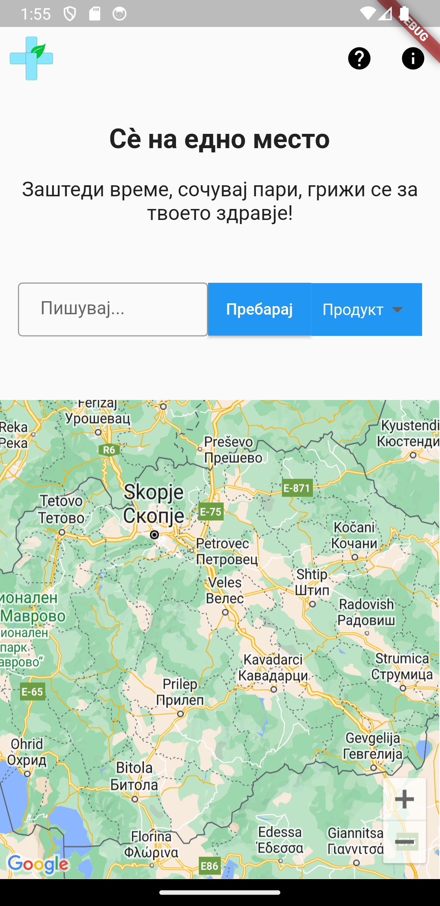
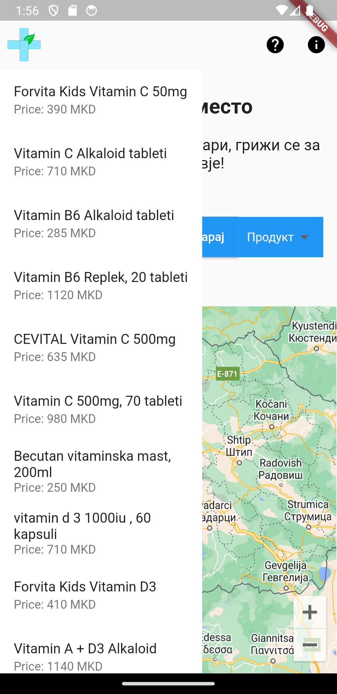
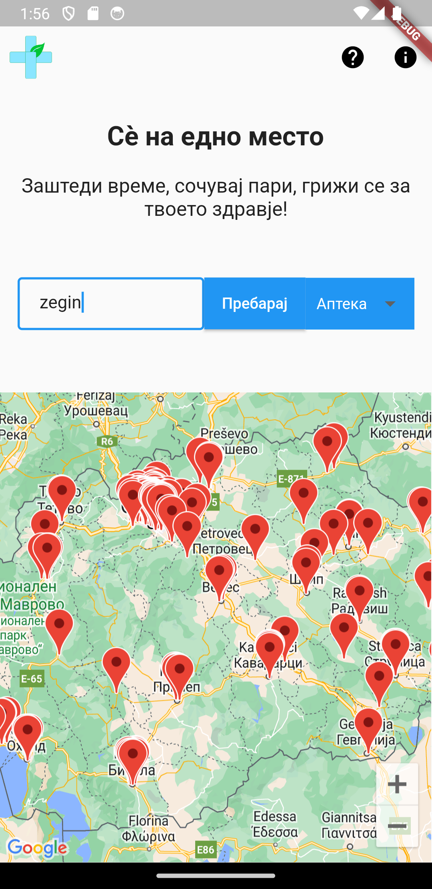

# Pharmprice

Pharmprice is a mobile application built using Flutter that helps users find nearby pharmacies on the map and compare the prices of products in different pharmacies. With Pharmprice, users can easily locate the nearest pharmacies and make informed decisions about where to purchase their medications or healthcare products based on pricing.





## Features

- Search for pharmacies in a specific location.
- View the locations of nearby pharmacies on the map.
- Compare prices of a searched product across various pharmacies.

## Installation

1. Clone the repository to your local machine.
2. Make sure you have Flutter installed. If not, follow the official Flutter installation guide: [Flutter Installation Guide](https://flutter.dev/docs/get-started/install)
3. Open the project in your preferred IDE (e.g., Android Studio, Visual Studio Code).
4. Install the required dependencies by running the following command:

```bash 
flutter pub get
```

5. Add your API_KEY for the Google map.

## Usage

1. Launch the application on your preferred mobile emulator or physical device using the following command:

```bash
flutter run
```

2. The app will load and display a map with your current location (or prompt you to allow location access).
3. To search for pharmacies, use the search bar and enter the location or use your current location.
4. Pharmacies near the searched location will be displayed as markers on the map.
5. To compare prices, enter the name of the product in the search bar, and the app will display prices from different pharmacies (if available).

## Contributing

Contributions are welcome! If you find any bugs or want to suggest improvements, please follow these steps:

1. Fork the repository.
2. Create a new branch for your feature/bugfix.
3. Make your changes and test them thoroughly.
4. Commit your changes with descriptive commit messages.
5. Push your changes to your forked repository.
6. Create a pull request to the main repository.

## License

This project is licensed under the <u><b>MIT License</b></u>.

## Contact

If you have any questions or need further assistance, feel free to contact the project team:

- [Simeon Markoski](mailto:simeonmarkoski10@gmail.com)
- [Eva Agovska](mailto:evaagovska@gmail.com)